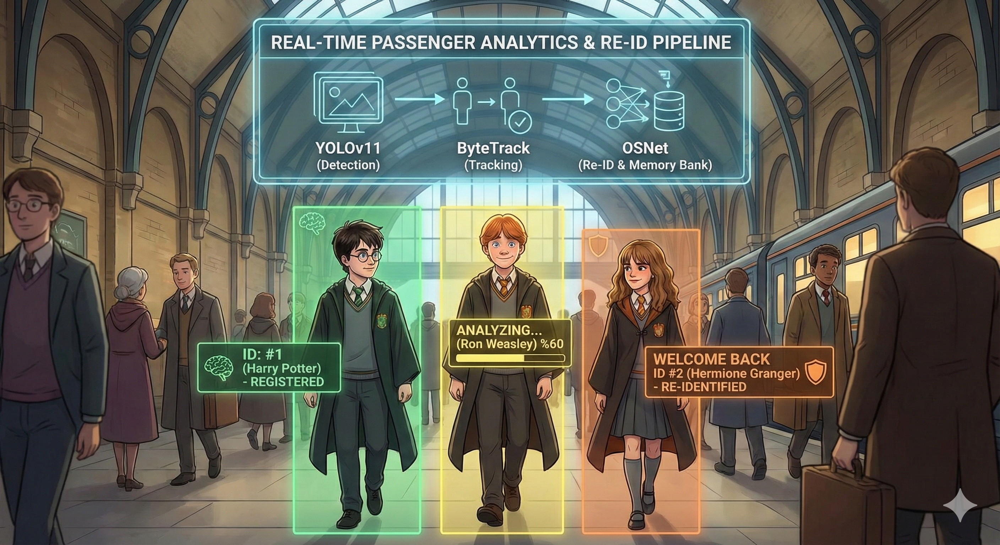

🚀 Real-Time Passenger Analytics & Re-ID Pipeline
=================================================

**An enterprise-grade computer vision pipeline designed for real-time passenger detection, tracking, and identity retention using Edge Computing.**

This project integrates **YOLOv11** (State-of-the-Art Detection) with **OSNet** (Omni-Scale Network for Re-Identification) to create a system that not only sees people but "remembers" them. It features a **Smart Memory Bank** that analyzes subjects over a specific duration to build robust digital identity profiles before registering them.

🌟 Key Features
---------------

  
   
  <em>Figure 1: Visualizing the AI pipeline workflow (Detection -> Tracking -> Re-ID & Memory Bank)</em>

*   **⚡ Real-Time Inference:** Optimized for **NVIDIA GPU (CUDA)** execution using FP16 (Half-Precision) for maximum FPS.
    
*   **🧠 Smart Memory Bank:** Features a "Cold Start" filter. The system analyzes a person for **50 frames** (~2 seconds) to build a stable vector profile before registering them.
    
*   **🆔 Re-Identification (Re-ID):** Recognizes returning passengers even if they leave the camera frame and come back later, assigning them their original ID (e.g., _"Welcome Back ID #1"_).
    
*   **📦 Lightweight Backbone:** Uses osnet\_ain\_x1\_0 trained on multi-source datasets (MSMT17, Duke, Market1501) for robust domain generalization in varying lighting conditions.
    
*   **🛡️ Robust Tracking:** Integrated **ByteTrack** algorithm to handle occlusions and crossovers effectively.
    
*   **📈 TensorBoard Ready:** Structure allows for future logging of metrics and embedding visualizations.
    

🏗️ System Architecture
-----------------------

The pipeline operates in three synchronous stages per video frame:

1.  **Detection (The Eyes):** YOLOv11x (Extra Large) detects humans in the frame with high accuracy.
    
2.  **Tracking (The Continuity):** ByteTrack maintains ID consistency across adjacent frames (handling short disappearances).
    
3.  **Feature Extraction (The Brain):** OSNet extracts a **512-dimensional embedding vector** (digital fingerprint) from the detected person crop.
    

> **Privacy Note:** This architecture is designed to be **Privacy-First**. We do not store raw face images in a database; we only store mathematical vectors (embeddings).

🛠️ Installation & Setup
------------------------

We have automated the complex dependency management (often called "Dependency Hell") with a custom script.

### 1\. Clone the Repository
`   git clone https://github.com/your-username/custom-passenger-analytics.git  cd custom-passenger-analytics   `

### 2\. Download Model Weights (Critical) 📥

You must download the pre-trained Re-ID weights and place them in the weights/ directory.

Model

Description

Download Link

Path

**OSNet (AIN)**

Re-ID Backbone (Multi-Source)

[**Download .pth File**](https://drive.google.com/file/d/1nIrszJVYSHf3Ej8-j6DTFdWz8EnO42PB/view?usp=sharing)

weights/osnet\_ain\_ms\_d\_c.pth

**YOLOv11**

Object Detector

_Auto-downloads on first run_

weights/yolo11x.pt

_⚠️_ _**Important:**_ _Ensure the OSNet file is named exactly osnet\_ain\_ms\_d\_c.pth and placed inside the weights folder. Do not extract it as a folder._

### 3\. Run the Auto-Installer 🪄

Installing torchreid manually can cause errors due to build isolation (e.g., ModuleNotFoundError: numpy or gdown). We wrote a custom installer install.py to fix this sequence.

**Do NOT run pip install -r requirements.txt directly.** Instead, run:

`   python install.py   `

**What does install.py do?**

1.  Installs core build tools (numpy, cython, gdown) first.
    
2.  Disables pip's build isolation to compile the Re-ID engine correctly.
    
3.  Installs the rest of the stack (ultralytics, opencv, tensorboard, etc.).
    

🚀 Usage
--------

Once installed and the weights are in place, run the main pipeline:

`   python main.py   `

### Controls

*   **q**: Press 'q' to stop the stream and close the application.
    

### Configuration

You can tweak the logic inside main.py to fit your camera setup:

`# Number of frames to wait before saving a person to memory (Default: 50)  FRAMES_TO_REGISTER = 50   # Similarity threshold (0.0 - 1.0). Higher means stricter matching.  SIMILARITY_THRESHOLD = 0.65` 

📊 Visuals & UI (HUD)
---------------------

The system provides a Heads-Up Display (HUD) on the video feed to visualize the AI's decision-making process:

*   🟡 **Yellow Bar & Text:** ANALYZING... @. The system is learning the person's features. It waits for 50 clear frames to ensure quality.
    
*   🟢 **Green Box:** ID SAVED. The person is registered in the memory bank.
    
*   🟠 **Orange Box:** WELCOME BACK ID #1. The person left the frame and returned, and was successfully recognized by the Re-ID engine.
    

📂 Project Structure
--------------------

custom-passenger-analytics/
├── env/                   # Virtual Environment
├── weights/               # MODEL WEIGHTS GO HERE
│   ├── osnet_ain_ms_d_c.pth  <-- (Download this manually)
│   └── yolo11x.pt            <-- (Auto-downloaded)
├── install.py             # ✨ Smart Installer Script
├── main.py                # 🧠 Main Inference Pipeline
├── requirements.txt       # Dependency list
├── README.md              # Documentation
└── .gitignore

🔧 Requirements
---------------

*   **OS:** Windows 10/11 or Linux
    
*   **Python:** 3.8+
    
*   **GPU:** NVIDIA GPU with CUDA support is **highly recommended** for YOLOv11x.
    
    *   _CPU Mode is available but might be slow (~1-3 FPS) with the 'X' model._
        

🔮 Future Roadmap (Fine-Tuning)
-------------------------------

Currently, the model outputs raw Identity Vectors for tracking. The next phase of development involves **Transfer Learning** on the **PA-100K** and **RAP v2** datasets.

This will enable the system to output semantic attributes such as:

*   Gender: Female
    
*   Hair: Long
    
*   UpperBody: Red T-Shirt
    
*   Accessory: Backpack
    

### Acknowledgements

*   Based on _Torchreid_ by KaiyangZhou.
    
*   Powered by _Ultralytics YOLO_.
    

_Developed for Custom Enterprise Solutions._